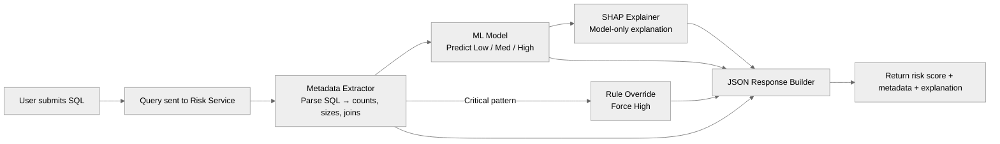
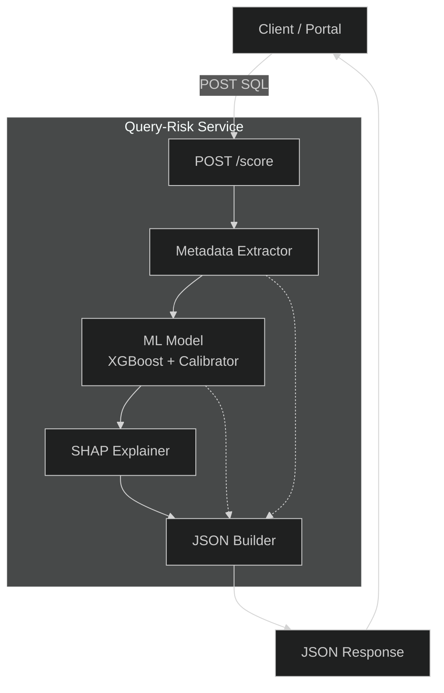
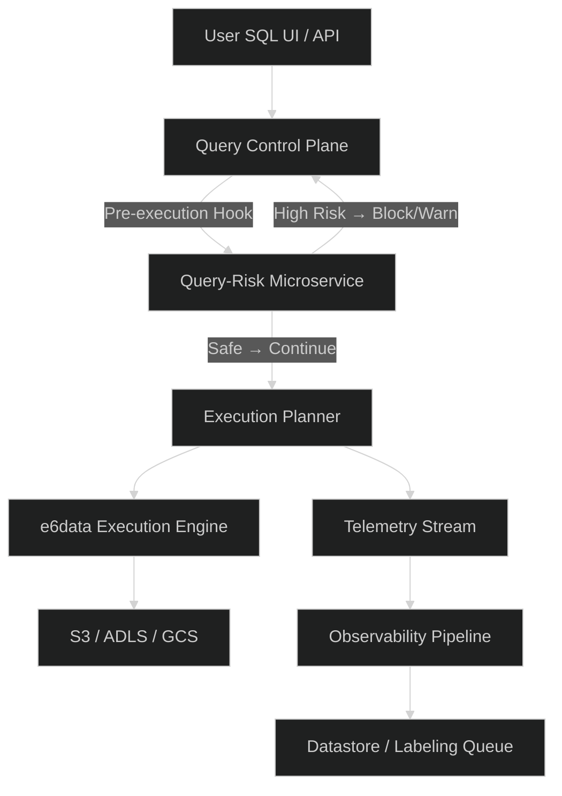

# **Query Risk Scoring — PoC for e6data**

A lightweight pre-execution risk scoring system that predicts the cost impact of an incoming SQL query before it reaches the execution engine.
The goal: **identify expensive queries early**, flag unsafe patterns (Cartesian joins, massive scans, SELECT * on huge tables), and return a **Low / Medium / High** risk score with an explanation.

This PoC evaluates a SQL string and produces:

* Risk level (0 = Low, 1 = Medium, 2 = High)
* Probability distribution
* Extracted metadata (joins, table sizes, filters, windows, subqueries…)
* SHAP-based interpretability (model-based reasoning)
* Hard safety overrides (critical patterns → forced High)

Powered by: **Metadata extraction → ML model → Rule-layer overrides**.

---

# **1. How It Works**

### **Core Pipeline**

1. User submits a SQL query
2. Metadata extractor parses structural and cost-related signals
3. Model predicts risk (XGBoost + calibration)
4. SHAP explains model reasoning (where applicable)
5. Rule engine enforces mandatory red flags
6. System returns a structured JSON response

Fast (<50ms), deterministic, and production-aligned with the way e6data evaluates query cost internally.

---

# **2. User Flow**



---

# **3. System Architecture**

### **A. Query Risk Scoring System (Standalone)**



---

### **B. How It Fits into e6data Execution Pipeline (Concept)**



---

# **4. Output Example**

Input:

```
SELECT * FROM big_sales_table WHERE amount > 500;
```

Output:

```json
{
  "prediction": 1,
  "probabilities": [
    0.0,
    0.977115619501889,
    0.022884380498110934
  ],
  "metadata": {
    "num_tables": 1,
    "num_joins": 0,
    "num_filters": 0,
    "num_subqueries": 0,
    "subquery_depth": 0,
    "num_aggregates": 0,
    "has_groupby": 0,
    "has_orderby": 0,
    "has_limit": 0,
    "select_star": 1,
    "window_functions": 0,
    "udf_usage": 0,
    "s3_scan": 0,
    "cartesian_join": 0,
    "query_length": 30,
    "estimated_table_size_max": 10000000,
    "estimated_join_output": 10000000,
    "estimated_output_rows": 10000000,
    "estimated_sort_cost": 232534966.64211535,
    "select_star_columns_estimate": 4
  },
  "shap": null
}
```

If the query triggers a catastrophic pattern:

* Cartesian Join (`ON 1=1`, `CROSS JOIN`)
* SELECT * on massive tables
* Explosive fan-out joins

The rule layer overrides the model and returns:

```
prediction: High
```

Every time. Deterministic.

---

# **5. Why This Matters (for e6data)**

* **Prevents cluster blow-ups** caused by naive SELECT * or accidental cartesian joins
* **Protects the execution engine** from unbounded scans
* **Gives instant feedback** before the planner even touches the query
* **Adds explainability** (SHAP + rule-layer) so users understand *why*
* **Paves the way for an autonomous cost-based gatekeeper** inside e6data’s control plane
* Works as a **lightweight microservice** the engine can call synchronously

This PoC is designed to be extended into a production policy layer.

---

# **6. Running It Locally**

### Install

```
pip install -r requirements.txt
```

### Train

```
python train_model.py
```

### Run interactive inference

```
python infer.py "SELECT * FROM users"
```

### Batch test (60 curated SQL queries)

```
python batch_infer.py
```

### Streamlit UI

```
streamlit run app_streamlit.py
```

---

# **7. Files Overview**

```
metadata_extractor.py    → SQL parsing + cost signals
train_model.py           → XGBoost training + calibration
infer.py                 → Model inference + SHAP + rule overrides
batch_infer.py           → Test queries runner
app_streamlit.py         → UI to demo scoring
synthetic.csv            → Training data
tables_config.py         → Table sizes/types used for metadata estimation
```

If you want adjustments (more concise, more bold, more technical, less technical), tell me and I’ll tailor it exactly to your pitch style.
