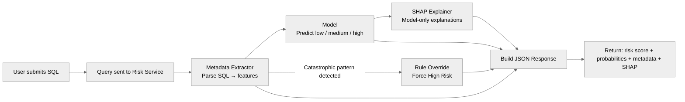
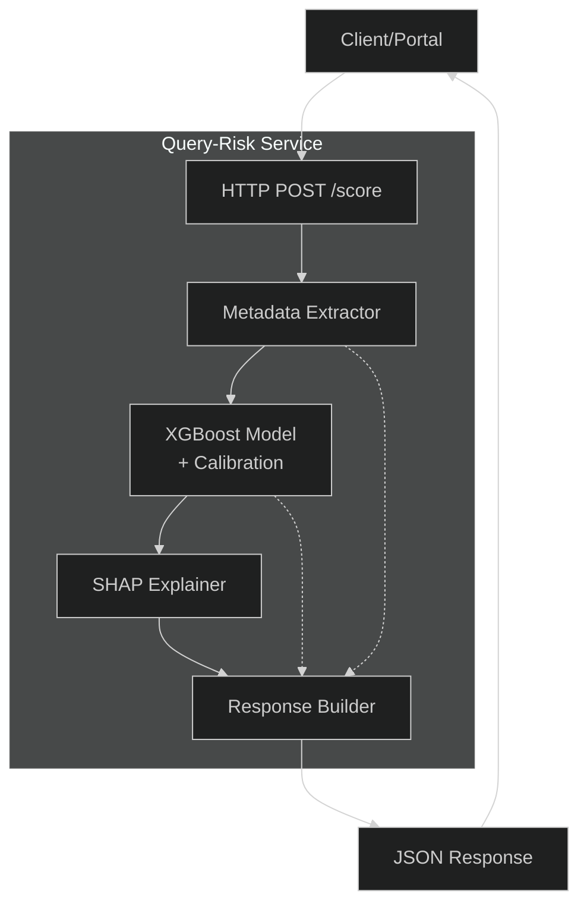
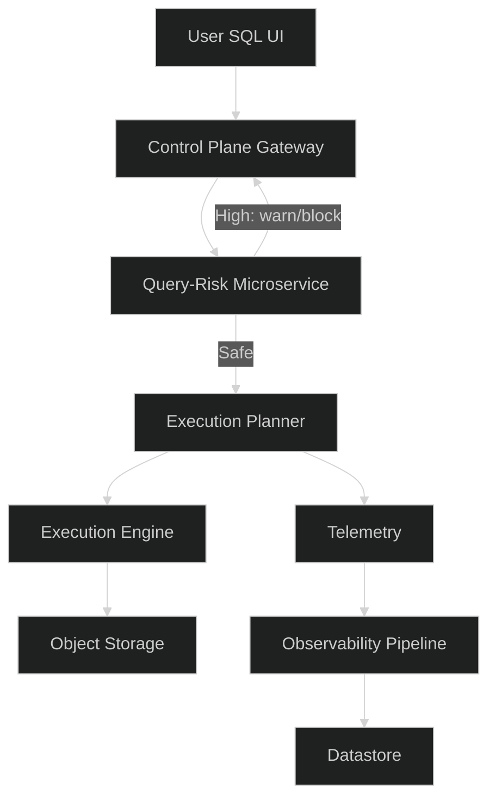

# **Query Risk Scoring System — PoC**

A lightweight microservice that scores SQL queries for **execution risk** before they hit the compute engine.
It analyzes SQL structure, estimates potential compute cost, runs an ML model, applies safety rules, and returns a clean JSON output.

Built to mimic a real pre-execution guardrail inside a lakehouse engine.

---

# **1. What This Service Does**

When you send a SQL query, the service returns:

* **risk level:**
  `0 = low`, `1 = medium`, `2 = high`

* **probabilities:** model confidence

* **metadata:** what the query structurally looks like

* **shap:** why the model made its prediction (if model used)

* **rule overrides:** force HIGH for catastrophic patterns

This is how control planes decide **resource allocation**, **warnings**, or **blocks**.

---

# **2. Quick User Flow**



This is the real pipeline engines use.

---

# **3. System Architecture (Microservice)**



---

# **4. How It Fits Into a Control Plane**



---

# **5. What Metadata Means**

Example:

```json
{
  "estimated_join_output": 10000000
}
```

**Meaning:**
“If this join runs, expect ~10 million rows created during the join step.”

This drives:

* memory needed
* shuffle load
* network cost
* engine scaling decisions
* risk score

Other fields follow the same idea:
numbers that hint at **how much work the engine will do**.

---

# **6. Rule Overrides (Non-negotiable Safety)**

The model can be wrong. Some patterns are too dangerous.

Hard-coded overrides:

* **Cartesian join → HIGH**
* **Huge SELECT * scan → HIGH**
* **Extreme fan-out → HIGH**

These run before the model output is returned.

---

# **7. Running the PoC**

Train:

```bash
python train_model.py
```

Infer:

```bash
python infer.py "SELECT * FROM big_sales_table WHERE amount > 500"
```

UI:

```bash
streamlit run app_streamlit.py
```

---

# **8. Repo Structure**

```
metadata_extractor.py
generate_dataset.py
train_model.py
infer.py
app_streamlit.py
xgb_query_risk.joblib
README.md
```

---

# **9. Example Output**

```json
{
  "prediction": 2,
  "probabilities": [
    0.0,
    0.0,
    1.0
  ],
  "metadata": {
    "num_tables": 2,
    "num_joins": 1,
    "num_joins": 1,
    "num_filters": 0,
    "num_filters": 0,
    "num_subqueries": 0,
    "subquery_depth": 0,
    "num_aggregates": 0,
    "has_groupby": 0,
    "has_orderby": 0,
    "num_aggregates": 0,
    "has_groupby": 0,
    "num_aggregates": 0,
    "num_aggregates": 0,
    "has_groupby": 0,
    "has_orderby": 0,
    "has_limit": 0,
    "select_star": 1,
    "window_functions": 0,
    "udf_usage": 0,
    "s3_scan": 0,
    "cartesian_join": 1,
    "query_length": 57,
    "estimated_table_size_max": 10000000,
    "estimated_join_output": 10000000,
    "estimated_output_rows": 10000000,
    "estimated_sort_cost": 232534966.64211535,
    "select_star_columns_estimate": 8
  },
  "shap": null
}
```

Translation:

* Found a cartesian join
* Estimated 10M row explosion
* Overrode the model
* Forced HIGH risk
* SHAP is null (model wasn’t used)

---

# **10. Done**

This PoC behaves like a **real control-plane guardrail**:

