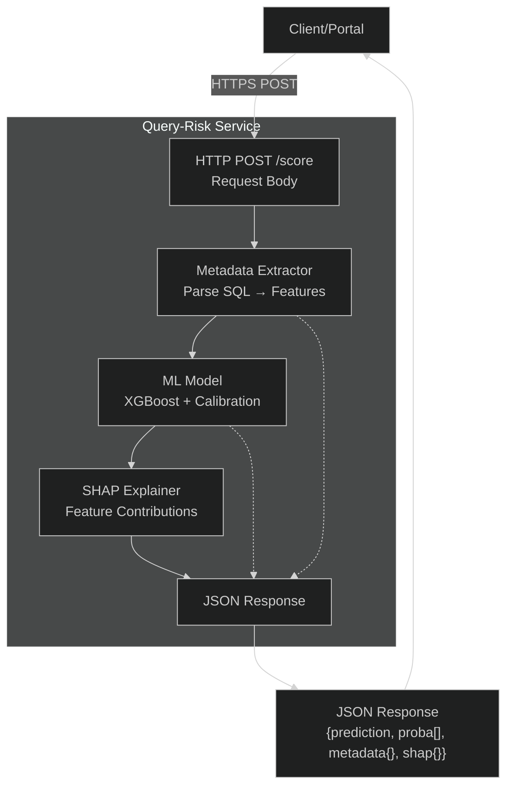
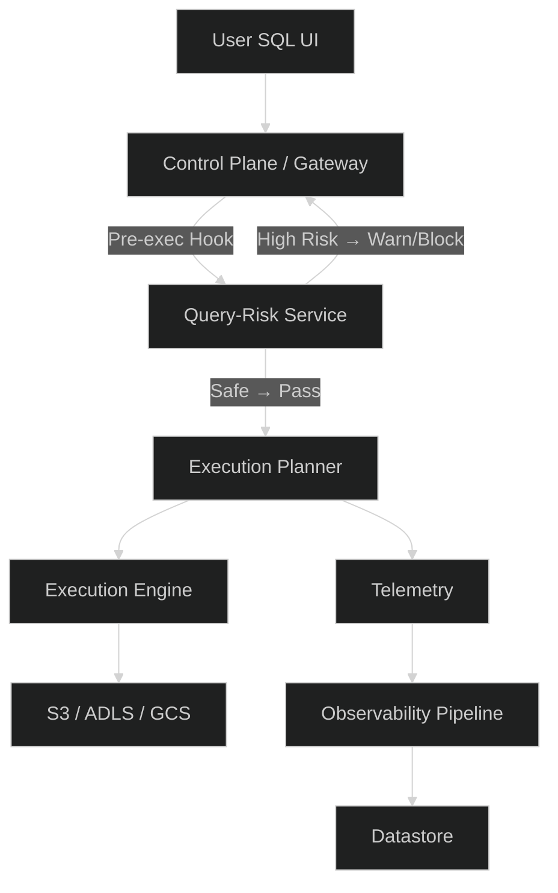

# **Query Risk Scoring System — PoC**

A lightweight control-plane microservice that scores SQL queries for execution risk using:

* metadata extraction
* a trained XGBoost model
* SHAP interpretability
* rule-based overrides for catastrophic patterns

Designed to integrate into a lakehouse engine’s pre-execution workflow.

---

## **System Architecture**

### **Query Risk Scoring Flow**



---

### **Integration in Control Plane**



---

## **What the Service Returns**

* **risk level:** `0 (low)`, `1 (medium)`, `2 (high)`
* **probabilities:** calibrated P(low/med/high)
* **metadata:** extracted SQL structure + estimated costs
* **shap:** per-feature contribution (or null if rule override fires)

---

## **Rule Overrides**

Hard, non-negotiable safety checks:

* **Cartesian join → risk = 2**
* **Large table + SELECT * → risk = 2**
* **Extreme fan-out indicators → risk = 2**

These take priority over the model.

---

## **Feature Set**

Metadata extractor generates:

* structural features (joins, tables, filters, subqueries, depth)
* cost features (table size, join output, output rows, sort cost)
* compute pressure signals (shuffle, skew, memory)
* operators (aggregates, windows, UDFs, select star)

---

## **Running the PoC**

Train:

```bash
python train_model.py
```

Infer:

```bash
python infer.py "SELECT * FROM big_sales_table WHERE amount > 500"
```

UI:

```bash
streamlit run app_streamlit.py
```

---

## **Repo Structure**

```
metadata_extractor.py
generate_dataset.py
train_model.py
infer.py
app_streamlit.py
xgb_query_risk.joblib
README.md
```

---

## **Example Output**

```json
{
  "prediction": 2,
  "probabilities": [
    0.0,
    0.0,
    1.0
  ],
  "metadata": {
    "num_tables": 2,
    "num_joins": 1,
    "num_joins": 1,
    "num_filters": 0,
    "num_filters": 0,
    "num_subqueries": 0,
    "subquery_depth": 0,
    "num_aggregates": 0,
    "has_groupby": 0,
    "has_orderby": 0,
    "num_aggregates": 0,
    "has_groupby": 0,
    "num_aggregates": 0,
    "num_aggregates": 0,
    "has_groupby": 0,
    "has_orderby": 0,
    "has_limit": 0,
    "select_star": 1,
    "window_functions": 0,
    "udf_usage": 0,
    "s3_scan": 0,
    "cartesian_join": 1,
    "query_length": 57,
    "estimated_table_size_max": 10000000,
    "estimated_join_output": 10000000,
    "estimated_output_rows": 10000000,
    "estimated_sort_cost": 232534966.64211535,
    "select_star_columns_estimate": 8
  },
  "shap": null
}
```
