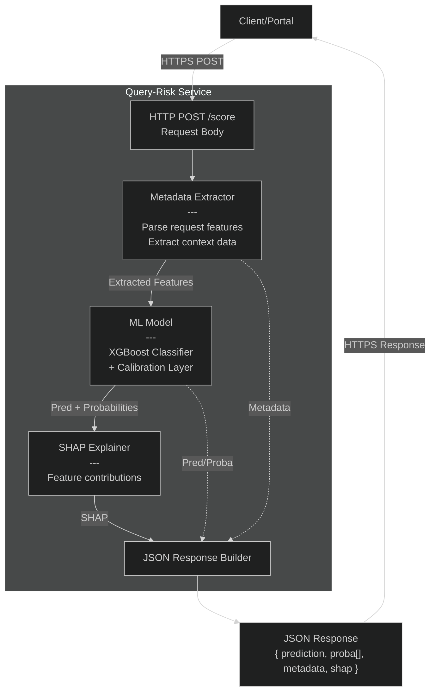
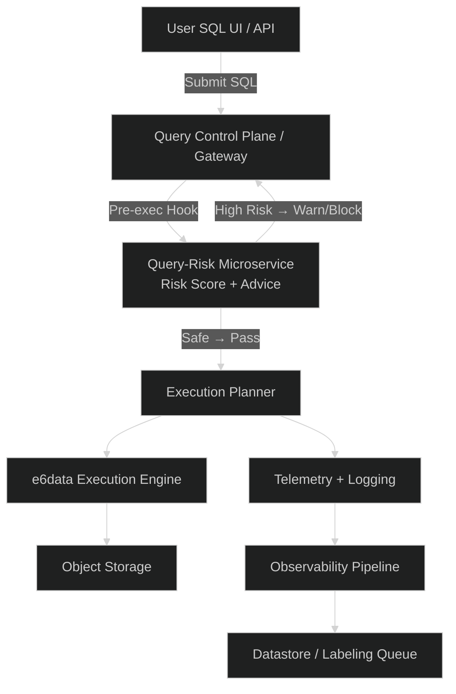
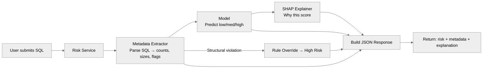

# **Query Risk Scoring — e6data PoC**

A lightweight **pre-execution SQL risk detector** that evaluates incoming queries using a hybrid of:

* **Static metadata extraction**
* **Structured rule overrides (guaranteed safety)**
* **A calibrated ML classifier**
* **Optional SHAP explainability**

The goal: give the engine an early warning signal so it can **avoid runaway compute, prevent cluster blowups, and auto-route or block unsafe SQL** before execution.

---

## **1. What This PoC Does**

* Parses SQL and extracts structural + cost-hint metadata
* Scores every query as **Low / Medium / High Risk**
* Applies **hard safety rules** for catastrophic patterns:

  * Cartesian join
  * Huge table + SELECT *
  * Multi-level nesting
* Returns:

  * prediction
  * probability vector
  * extracted metadata
  * SHAP attributions (when available)

This runs in **milliseconds**, making it viable for a live preflight hook.

---

## **2. Architecture Overview**

### **Query-Risk Scoring Flow**



---

### **How This Fits Into e6data’s Ecosystem**



---

## **3. Quick User Flow**



---

## **4. Why This Matters (Business Value)**

This PoC demonstrates a **pre-execution risk layer** that protects the engine from bad SQL before it burns compute.

### **1. Cost Control**

Stops unbounded scans, cross-joins, and SELECT * on massive tables before execution.
Direct reduction in compute waste and autoscaling spikes.

### **2. More Stable Clusters**

Bad queries cripple latency and disrupt co-tenancy.
Flagging them early keeps workloads smooth and predictable.

### **3. Path to Autonomous Governance**

This scoring loop becomes the base for:

* continuous telemetry ingestion
* weekly retraining with new patterns
* automated guardrails for different customer tiers

A differentiated capability that positions e6data as *proactive* rather than reactive.

---

## **5. Running the PoC**

### **Install**

```
pip install -r requirements.txt
```

### **Train**

```
python train_model.py
```

### **Single Inference**

```
python infer.py "SELECT * FROM big_sales_table WHERE amount > 500"
```

### **Batch Testing**

```
python batch_infer.py
```

(Default = `test_queries.txt`)

---

## **6. Streamlit UI**

```
python app_streamlit.py
```

Shows:

* risk level
* metadata
* probabilities
* SHAP explanations (when available)

---

## **7. What’s Next (Optional Enhancements)**

* Plug into control plane as a real pre-execution hook
* Build telemetry → retrain loop
* Improve metadata richness via real engine stats
* Expand SHAP for customer-facing transparency

---

## **8. Folder Structure (Clean & Simple)**

```
query_risk_poc/
  ├── train_model.py
  ├── infer.py
  ├── batch_infer.py
  ├── metadata_extractor.py
  ├── tables_config.py
  ├── synthetic_generator.py
  ├── synthetic_v3.csv
  ├── test_queries.txt
  ├── xgb_query_risk.joblib
  ├── app_streamlit.py
  └── README.md
```
